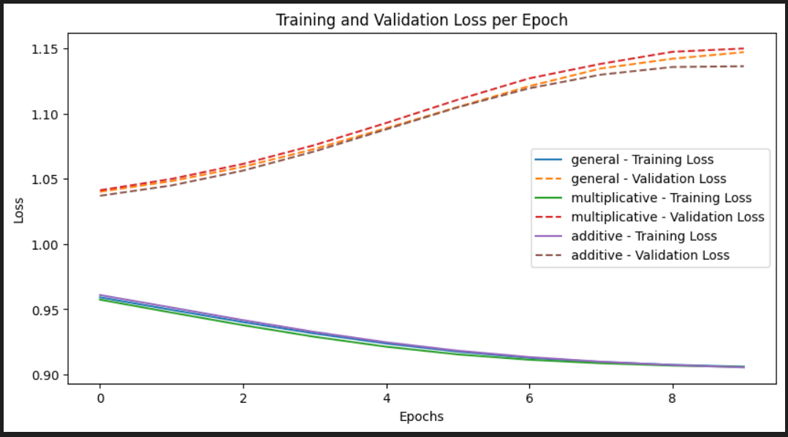

1. Dataset Selection
For translation between Vietnamese and English, we can use the Opus100 dataset, which is a reputable dataset for machine translation tasks. This dataset is publicly available and widely used in the research community.

Dataset Source:
Opus100: https://huggingface.co/datasets/opus100

2. Dataset Preparation
Text Normalization
Text normalization involves converting text to a standard format. This includes lowercasing, removing punctuation, and handling special characters.

Tokenization
Tokenization is the process of splitting text into individual tokens (words or subwords). For Vietnamese, we need to handle word segmentation carefully due to the lack of spaces between words in some cases.

Word Segmentation
For Vietnamese, we can use the pyvi library, which is specifically designed for Vietnamese text processing. For English, we can use the spacy library.

Libraries and Tools:

Pyvi: A Python library for Vietnamese text processing.
Spacy: A Python library for advanced natural language processing.
Credits:

Pyvi: https://github.com/trungtv/pyvi
Spacy: https://spacy.io/

3.

